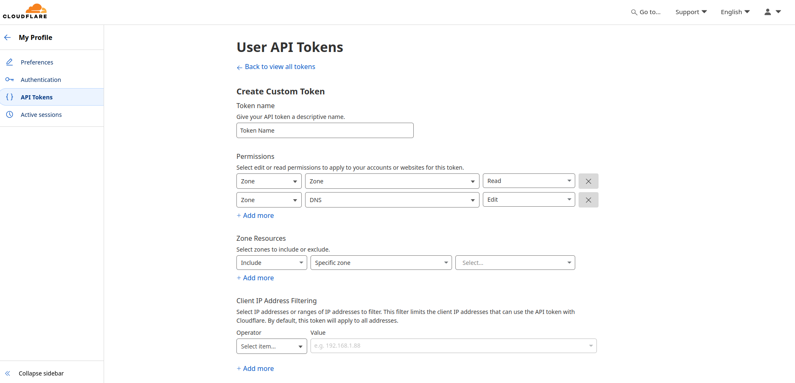
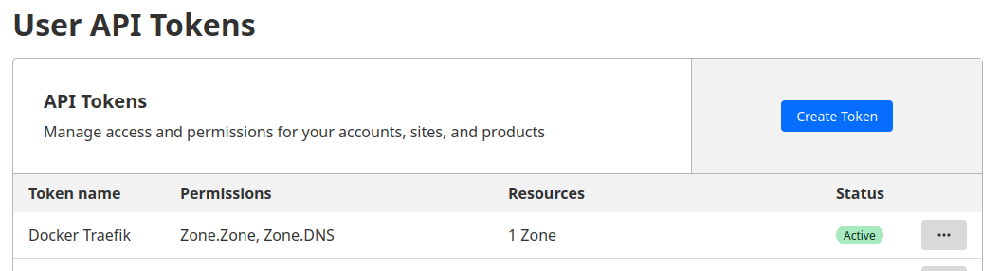

# Homelab Arch

## Setup

Copia o `.env.example` para `.env` e ajusta `DOMAIN_NAME` (e os demais valores) para o seu ambiente:

```bash
cp .env.example .env
```

Vários arquivos de config são montados como volume dentro dos containers (Traefik `config.d/`, Authelia `config/`) e por isso **não** recebem a substituição de `${VAR}` que o `docker compose` faz nos `compose.yml`. Os templates (`*.yml.tpl`, com `${DOMAIN_NAME}` no lugar do domínio) ficam versionados, e o script `render-templates.sh` (raiz do projeto) os renderiza para os `.yml` reais que os containers de fato leem:

```bash
./render-templates.sh
```

Rode esse script sempre que criar um `.tpl` novo ou mudar `DOMAIN_NAME` no `.env`. Os `.yml` gerados são ignorados no git; só os `.tpl` ficam versionados. Comportamento por diretório:

- `traefik/data/templates/*.yml.tpl` → renderizado pra `traefik/data/config.d/<nome>.yml`. **Nunca sobrescreve** um arquivo que já existe em `config.d/` (esses arquivos costumam ser editados à mão depois, com IP/porta reais do backend).
- `authelia/config/configuration.yml.tpl` → sempre re-renderizado em `authelia/config/configuration.yml` (só tem placeholder de domínio, sem edição manual).
- `pihole/dns.cnameRecords.tpl` → sempre re-renderizado em `pihole/cname.env` (ver seção [Pi-Hole](#pi-hole) abaixo).

## Network

Create network external.

```shell
docker network create --gateway 172.42.0.1 --subnet 172.42.0.0/24 proxy
```

## Pi-Hole

Edit `/etc/hosts`.

```shell
sudo nano /etc/hosts
```

Added line

```shel
127.0.0.1  docker.local
```

O `pihole/compose.yml` já aplica via variáveis de ambiente `FTLCONF_*` (lidas a cada start pelo
FTL, o que deixa os campos correspondentes read-only na UI web) os passos que antes eram feitos
manualmente na UI:

- **Local CNAME Records** (`dns.cnameRecords`): edite `pihole/dns.cnameRecords.tpl` — uma lista em
  texto simples, um registro `<cname>,<target>` por linha (linhas em branco e começadas com `#`
  são ignoradas), podendo usar qualquer variável definida no `.env` em cada linha, ex.:
  `pihole.${DOMAIN_NAME},docker.local` — e rode `./render-templates.sh`, que gera
  `pihole/cname.env` (carregado pelo `env_file` do serviço `pihole`).
- **Bind only interface** (`dns.listeningMode`): variável `PIHOLE_LISTENING_MODE` no `.env`
  (default `BIND`).
- **`dns.hosts`** (IP real da máquina + `docker.local`): variável `PIHOLE_HOST_IP` no `.env`.
- **`dhcp.start`**: variável `PIHOLE_DHCP_START` no `.env`.
- **Senha de admin** (`webserver.api.password`): variável `PIHOLE_PASSWORD` no `.env`. Só é
  aplicada no primeiro start (ou se `pihole/config/etc-pihole` for apagado) — trocar o valor no
  `.env` depois disso não muda a senha já persistida.

Depois de ajustar o `.env` e/ou `pihole/dns.cnameRecords`, rode `./pihole/reload.sh`.

**Por que não basta reiniciar:** campos vindos de `FTLCONF_*` (como `dns.cnameRecords`) ficam
travados para edição em tempo real — o próprio `pihole-FTL` recusa alterá-los via CLI/API
enquanto vierem de env var, e só são reaplicados quando o container é **recriado** com o env
atualizado. `docker compose restart pihole` reexecuta o entrypoint, mas com as variáveis de
ambiente que já estavam congeladas desde a criação do container (`pihole/cname.env` é um
`env_file`, lido só no `docker compose up`/`create`, nunca em um `restart`) — por isso um CNAME
novo no `.tpl` não aparece até o container ser recriado. `./pihole/reload.sh` automatiza isso:
roda `./render-templates.sh` (regenera `pihole/cname.env`) e depois `docker compose up -d pihole`
(recria só o serviço `pihole`, sem afetar os outros containers da stack).

## Clouflare

Access this link to [create token](https://dash.cloudflare.com/profile/api-tokens) in Cloudflare.





## Traefik

Before uploading the container, create the following directories and files, giving them the necessary permissions.

```bash
mkdir -p traefik/data && cd traefik/data && touch acme.json && chmod 600 acme.json
```

Pra expor um novo host externo (não gerenciado pelo Docker, ex: Proxmox, GitLab), crie um arquivo em `traefik/data/templates/<nome>.yml.tpl` usando `${DOMAIN_NAME}` no `Host()`, seguindo os exemplos existentes (`pve.yml.tpl`, `registry.yml.tpl`, etc.), e rode `./render-templates.sh` pra gerar `traefik/data/config.d/<nome>.yml`.

## Portainer

Verifique os logs para obter o `setup_token`.

```bash
docker logs portainer -f
```

## Authelia

Sobe Authelia + Postgres (storage) + Redis (sessão), tudo isolado na pasta `authelia/`.

Cria os diretórios de dados com o dono correto. As imagens `postgres`/`redis` rodam como o
usuário interno `postgres`/`redis` (UID:GID `999:999`, não root e não o `PUID:PGID` do host), e
esses serviços não usam bind mount com `user:` como o `authelia` usa pra `./config` — se o
diretório for criado com outro dono, o container não consegue escrever no volume e falha ao subir:

```bash
mkdir -p authelia/postgres authelia/redis
sudo chown 999:999 authelia/postgres authelia/redis
```

Gera os secrets reais (nunca commitados, veja `.gitignore`) com o script:

```bash
./authelia/generate-secrets.sh
```

Ele grava `jwt_secret`, `session_secret`, `storage_password`, `storage_encryption_key` e `redis_password` em `secrets/authelia/` com permissão `600`, sem sobrescrever arquivos já existentes (use `-f`/`--force` para regenerar). `storage_password` é usado tanto pelo Authelia quanto como senha do usuário `authelia` no Postgres.

`authelia/config/configuration.yml.tpl` já usa `${DOMAIN_NAME}` — rode `./render-templates.sh` (na raiz do projeto) pra gerar o `.yml` real com o seu domínio. Se você alterar `CT_AUTHELIA_POSTGRES` ou `CT_AUTHELIA_REDIS` no `.env`, atualize também os hosts hardcoded em `configuration.yml.tpl` (`storage.postgres.address` e `session.redis.host` usam o nome do container diretamente, não uma env var).

### LDAP (lldap)

A Authelia autentica contra um backend `ldap`, servido por um **lldap** (`lldap/compose.yml`), que
sobe junto no mesmo stack. Gera os secrets dele com:

```bash
./lldap/generate-secrets.sh
```

Isso grava `jwt_secret`, `key_seed` e `user_pass` (senha do usuário `admin` da UI do lldap) em
`secrets/lldap/`. `secrets/authelia/ldap_password` (senha do bind user que a Authelia usa pra
consultar o diretório) é gerado junto com os outros secrets da Authelia, por
`./authelia/generate-secrets.sh`.

Depois de subir o lldap pela primeira vez, alguns passos manuais (não dá pra automatizar via
compose, precisa da UI do lldap):

0. **Chicken-and-egg do primeiro acesso:** o router `ldap-secure` em `lldap/compose.yml` já vem
   protegido pelo middleware `authelia@docker`. Mas nesse ponto a Authelia ainda não consegue
   autenticar ninguém (o bind user dela no LDAP nem existe ainda), então ela bloquearia o próprio
   acesso à UI do lldap. Comente temporariamente a linha
   `traefik.http.routers.ldap-secure.middlewares=authelia@docker` em `lldap/compose.yml` e rode
   `docker compose up -d lldap` antes dos passos abaixo. Descomente e rode
   `docker compose up -d lldap` de novo só no final, depois que o login em `auth.${DOMAIN_NAME}`
   já estiver funcionando.
1. Login em `https://ldap.${DOMAIN_NAME}` com o usuário `admin` e a senha de
   `secrets/lldap/user_pass`.
2. Criar o grupo `admins` em Groups.
3. Criar seus usuários (displayname, email, senha) e adicioná-los ao grupo `admins`.
4. Criar um usuário de serviço `authelia` — esse é o bind user que a Authelia usa pra consultar o
   diretório (nunca usar a conta `admin` pra isso):
   - **Adicione-o ao grupo builtin `lldap_strict_readonly`.** Sem isso o bind até funciona, mas o
     lldap trata a conta como "unprivileged" e limita o resultado de qualquer busca LDAP a ela
     mesma — a Authelia consegue bindar normalmente, mas responde "user not found" toda vez que
     alguém tenta logar (log da Authelia mostra o bind ok, mas nenhum outro usuário nunca é
     encontrado).
   - A senha do usuário `authelia` (deve ser igual ao conteúdo de `secrets/authelia/ldap_password`)
     só dá pra setar pela UI (Users → `authelia` → "Reset/Set password"). O lldap usa o protocolo
     OPAQUE (PAKE) pra registrar senha, com a matemática rodando no navegador (WASM) — não existe
     endpoint de API que aceite senha em texto puro, então não dá pra automatizar isso num script.

Depois de subir o stack, `auth.${DOMAIN_NAME}` deve responder com o portal de login do Authelia.

### Protegendo um serviço existente

Nenhum serviço fica protegido por padrão. Para exigir login do Authelia em outro serviço (ex: Portainer), adicione a label no `compose.yml` daquele serviço:

```yaml
- "traefik.http.routers.portainer.middlewares=authelia@docker"
```

Se o router já tiver outras middlewares, separe por vírgula.
