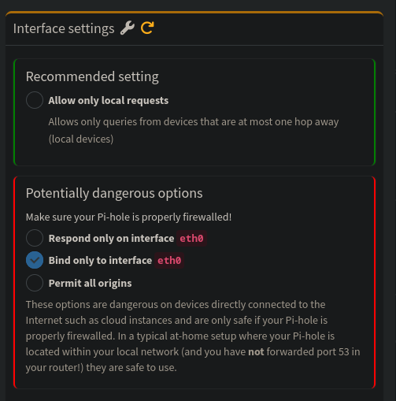
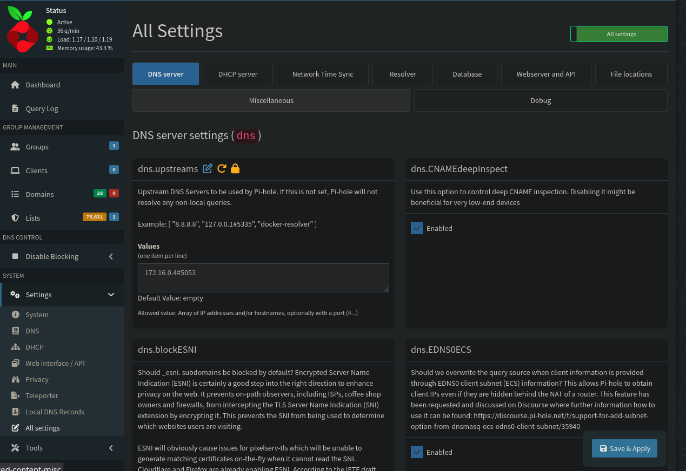
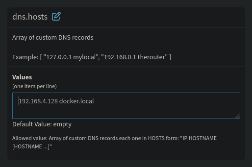
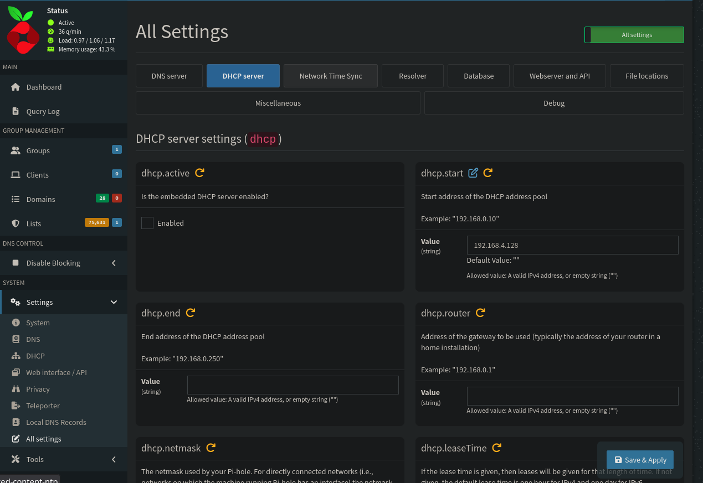

# Homelab Arch

## Setup

Copia o `.env.example` para `.env` e ajusta `DOMAIN_NAME` (e os demais valores) para o seu ambiente:

```bash
cp .env.example .env
```

Vários arquivos de config são montados como volume dentro dos containers (Traefik `config.d/`, Authelia `config/`) e por isso **não** recebem a substituição de `${VAR}` que o `docker compose` faz nos `compose.yml`. Os templates (`*.yml.tpl`, com `${DOMAIN_NAME}` no lugar do domínio) ficam versionados, e o script `render-templates.sh` (raiz do projeto) os renderiza para os `.yml` reais que os containers de fato leem:

```bash
./render-templates.sh
```

Rode esse script sempre que criar um `.tpl` novo ou mudar `DOMAIN_NAME` no `.env`. Os `.yml` gerados são ignorados no git; só os `.tpl` ficam versionados. Comportamento por diretório:

- `traefik/data/templates/*.yml.tpl` → renderizado pra `traefik/data/config.d/<nome>.yml`. **Nunca sobrescreve** um arquivo que já existe em `config.d/` (esses arquivos costumam ser editados à mão depois, com IP/porta reais do backend).
- `authelia/config/configuration.yml.tpl` → sempre re-renderizado em `authelia/config/configuration.yml` (só tem placeholder de domínio, sem edição manual).
- `authelia/config/users_database.yml.tpl` → renderizado **só na primeira vez** em `authelia/config/users_database.yml` (guarda credencial real depois de editado).

## Network

Create network external.

```shell
docker network create --gateway 172.42.0.1 --subnet 172.42.0.0/24 proxy
```

## Domain Pi-Hole

Edit `/etc/hosts`.

```shell
sudo nano /etc/hosts
```

Added line

```shel
127.0.0.1  docker.local
```

Create DNS Records [A/AAAA]

| Domain       | Ip          |
| ------------ | ----------- |
| docker.local | 192.168.0.x |

Local CNAME Records

| Domain                 | Target       |
| ---------------------- | ------------ |
| pihole.domain.com      | docker.local |
| portainer.domain.com   | docker.local |
| traefik.domain.com     | docker.local |
| auth.domain.com        | docker.local |

## Clouflare

Access this link to [create token](https://dash.cloudflare.com/profile/api-tokens) in Cloudflare.


## Traefik

Before uploading the container, create the following directories and files, giving them the necessary permissions.

```bash
mkdir -p traefik/data && cd traefik/data && touch acme.json && chmod 600 acme.json
```

Pra expor um novo host externo (não gerenciado pelo Docker, ex: Proxmox, GitLab), crie um arquivo em `traefik/data/templates/<nome>.yml.tpl` usando `${DOMAIN_NAME}` no `Host()`, seguindo os exemplos existentes (`pve.yml.tpl`, `registry.yml.tpl`, etc.), e rode `./render-templates.sh` pra gerar `traefik/data/config.d/<nome>.yml`.

## Pihole Tips



Configura o ip real da maquina local







## Portainer

Verifique os logs para obter o `setup_token`.

```bash
docker logs portainer -f
```

## Authelia

Sobe Authelia + Postgres (storage) + Redis (sessão), tudo isolado na pasta `authelia/`.

Cria os diretórios de dados:

```bash
mkdir -p authelia/postgres authelia/redis
```

Gera os secrets reais (nunca commitados, veja `.gitignore`) com o script:

```bash
./authelia/generate-secrets.sh
```

Ele grava `jwt_secret`, `session_secret`, `storage_password`, `storage_encryption_key` e `redis_password` em `secrets/authelia/` com permissão `600`, sem sobrescrever arquivos já existentes (use `-f`/`--force` para regenerar). `storage_password` é usado tanto pelo Authelia quanto como senha do usuário `authelia` no Postgres.

`authelia/config/configuration.yml.tpl` já usa `${DOMAIN_NAME}` — rode `./render-templates.sh` (na raiz do projeto) pra gerar o `.yml` real com o seu domínio. Se você alterar `CT_AUTHELIA_POSTGRES` ou `CT_AUTHELIA_REDIS` no `.env`, atualize também os hosts hardcoded em `configuration.yml.tpl` (`storage.postgres.address` e `session.redis.host` usam o nome do container diretamente, não uma env var).

`authelia/config/users_database.yml` guarda credencial real (hash de senha, e-mail), então é tratado diferente dos outros `.tpl`: o script gera esse arquivo **só na primeira vez** (a partir de `users_database.yml.tpl`) e nunca mais mexe nele depois — reruns de `render-templates.sh` pulam esse arquivo. Edite sempre o `users_database.yml` (gerado, ignorado no git), nunca o `.tpl`, senão o hash real acaba indo pro git.

Gera o hash da senha do usuário:

```bash
docker run --rm authelia/authelia:4.39 authelia crypto hash generate argon2 --password 'suasenha'
```

E cola em `users_database.yml`, no campo `password:` do usuário. O nome do usuário é a chave sob `users:` (por padrão `authelia`) — é esse nome que você usa pra logar, não o e-mail.

Depois de subir o stack, `auth.${DOMAIN_NAME}` deve responder com o portal de login do Authelia.

### Protegendo um serviço existente

Nenhum serviço fica protegido por padrão. Para exigir login do Authelia em outro serviço (ex: Portainer), adicione a label no `compose.yml` daquele serviço:

```yaml
- "traefik.http.routers.portainer.middlewares=authelia@docker"
```

Se o router já tiver outras middlewares, separe por vírgula.
